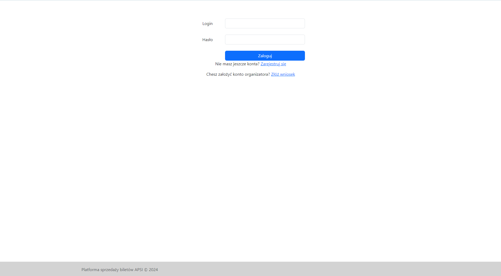
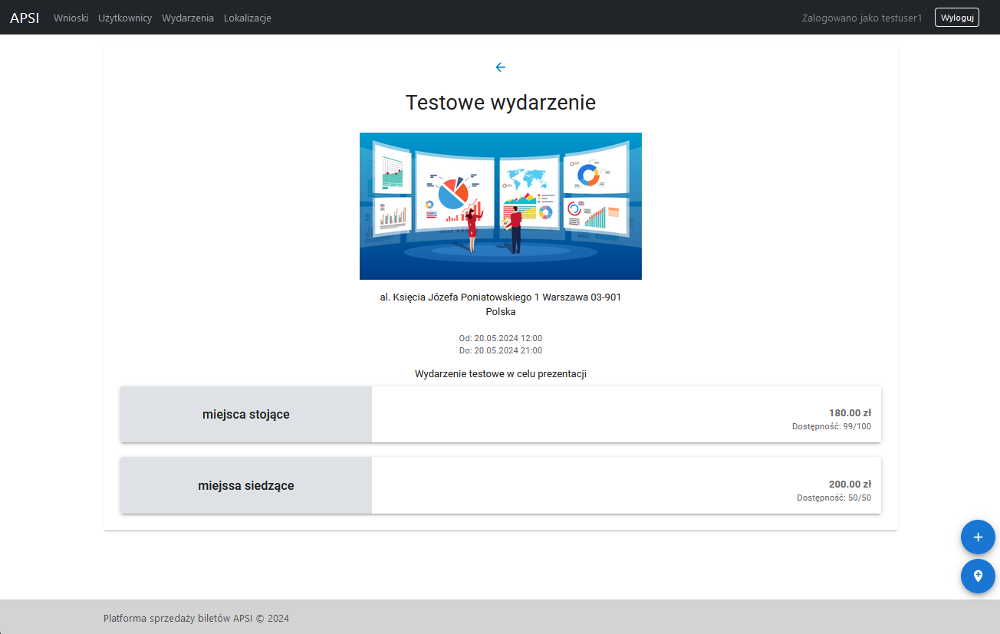
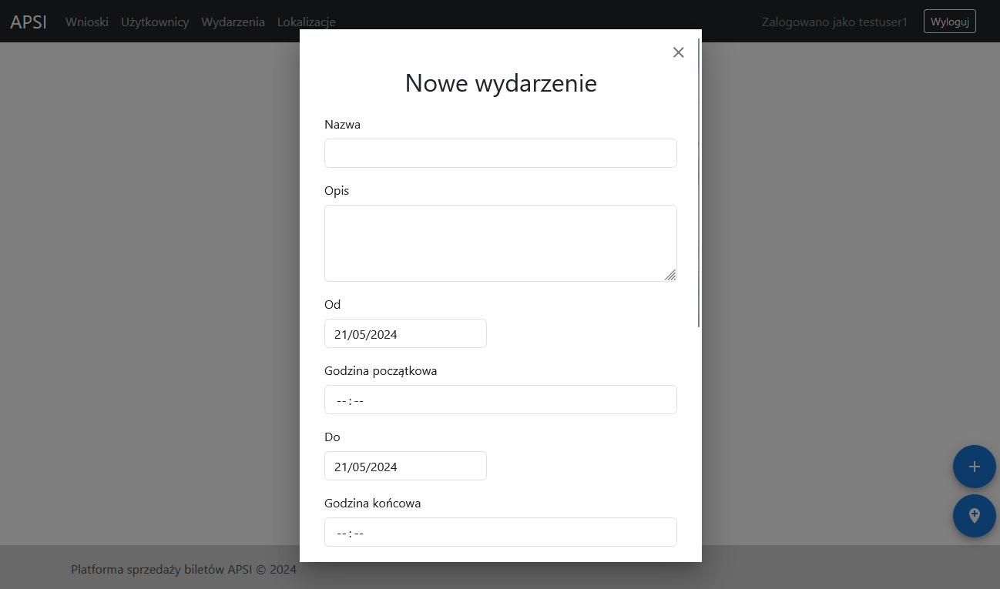
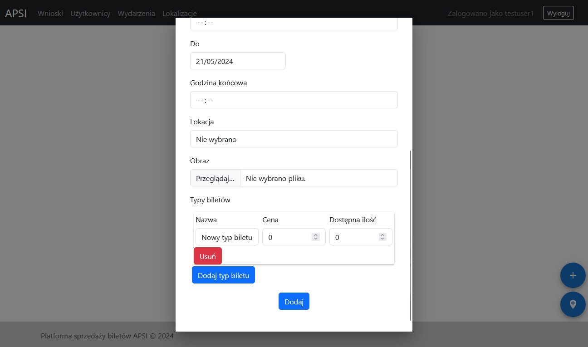

### Logowanie

W celu zalogowania się na konto administrator musi on wejść na stronę logowania (`/login`). Znajduje się na niej formularz, który musi zostać uzupełniony oraz wysłany. Formularz składa się z pól `Login` oraz `Hasło`. Formularz wysyłany jest przy użyciu przycisku `Zaloguj`. Sekwencja logowania zakończy się pomyślnie w przypadku, gdy podana zostanie odpowiednia kombinacja nazwy użytkownika oraz hasła, zgadzająca się z danymi znajdującymi się w systemie. W innym wypadku administrator zostanie poinformowany o wprowadzeniu niepoprawnego hasła. Po zalogowaniu zostaje on przekierowany na stronę główną. Pod formularzem logowania znajduje się także link prowadzący do strony rejestracji.

### Nawigacja i Strona główna

Głównym elementem strony głównej, który również obecny jest na pozostałych stronach aplikacji jest pasek nawigacyjny. Przy jego użyciu administrator może przejść do strony zawierającej listę wniosków o stworzenie konta organizatorów (przycisk `Wnioski`), do strony z listą wszystkich kont użytkowników (przycisk `Użytkownicy`), do strony zawierającej listę wydarzeń organizowanych w ramach aplikacji (przycisk `Wydarzenia`) lub do strony z listą wszystkich lokalizacji (przycisk `Lokalizacje`). Ponadto pasek nawigacyjny zawiera przycisk `Wyloguj` odpowiadający za wylogowywanie użytkownika z aplikacji oraz przekierowywujący do strony logowania. Dla administratorów dodatkowo w prawym dolnym rogu wyświetlane są przyciski odpowiadające kolejno za dodanie wydarzenia (ikona ze znakiem plus) oraz dodanie lokalizacji (ikona pinezki).

<!-- ### Lista wniosków

** TODO APSI-50 **

### Rozstrzyganie wniosku

** TODO APSI-50 **

### Lista użytkowników

** TODO APSI-49 ** -->

### Lista wydarzeń

Na stronie listy wydarzeń wyświetlane są wszystkie eventy organizowane w ramach systemu. Po wejściu na stronę automatycznie wyświetlane są wydarzenia zaplanowane na najbliższy tydzień. Elementy listy wyświetlane są jako niezależne karty zawierające informacje o wydarzeniu, takie jak jego nazwa, opis, lokalizacja oraz data. Administrator może użyć dedykowanego przycisku z ikoną oka, aby przejśc na stronę wydarzenia, zawierającą więcej infomacji na jego temat. W karcie wydarzenia znajduje się również przycisk z ikoną ołówka, przekierowujący na stronę edycji wydarzenia oraz przycisk z ikoną kosza umożliwiający usunięcie wydarzenia. Lista wydarzeń może być filtrowana poprzez użycie wyszukiwarki nazw eventów oraz zmianę zakresu dat wyświetlanych wydarzeń.

### Strona wydarzenia

Strona wydarzenia zawiera szczególowe informacje na temat samego wydarzenia oraz sprzedawanych na niego biletów. Administrator może zapoznać się tutaj z informacjami takimi jak nazwa wydarzenia, jego opis, lokalizacja, data początkowa i końcowa oraz rodzaje, dostępność oraz ceny biletów.

<!-- ### Edycja wydarzenia

** TODO APSI-26 **

### Usunięcie wydarzenia

** TODO APSI-27** -->

### Lista lokalizacji

Na stronie listy lokalizacji wyświetlane są wszystkie lokalizacje dodane do systemu.

### Tworzenie wydarzenia

W celu dodania nowego wydarzenia administrator musi użyć dedykowanego przycisku z ikoną znaku plus zlokalizowanego w prawym dolnym rogu aplikacji. Wyświetlone zostanie okno z formularzem tworzenia wydarzenia. Należy wypełnić danymi wyświetlane pola, po czym przesłać formularz. Pola `Nazwa`, `Od`, `Do` są obowiązkowe. Należy podać przynajmniej jeden typ biletów. Możliwe jest oddanie grafiki do wydarzenia. Po pomyślnym przesłaniu formularza wyświetlone zostanie potwierdzenie sukcesu operacji.

### Tworzenie lokalizacji

W celu dodania nowej lokalizacji administrator musi użyć dedykowanego przycisku z ikoną pinezki zlokalizowanego w prawym dolnym rogu aplikacji. Wyświetlone zostanie okno z formularzem tworzenia lokalizacji. Należy wypełnić danymi wyświetlane pola, po czym przesłać formularz. Pola `Kraj` oraz `Miejscowość` są obowiązkowe. Po pomyślnym przesłaniu formularza wyświetlone zostanie potwierdzenie sukcesu operacji.