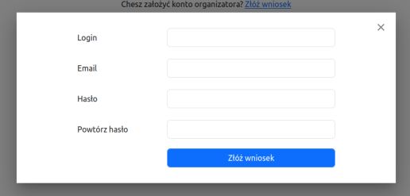
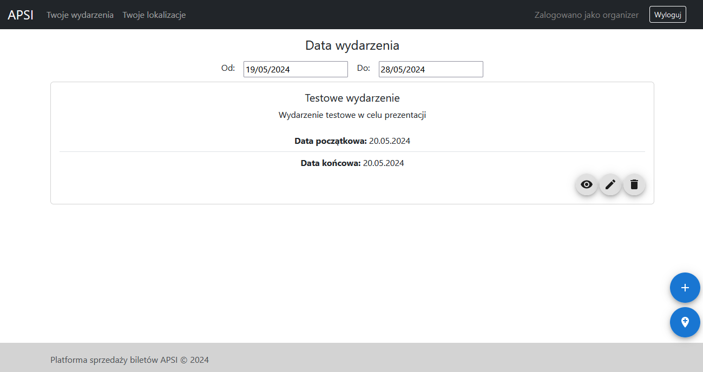
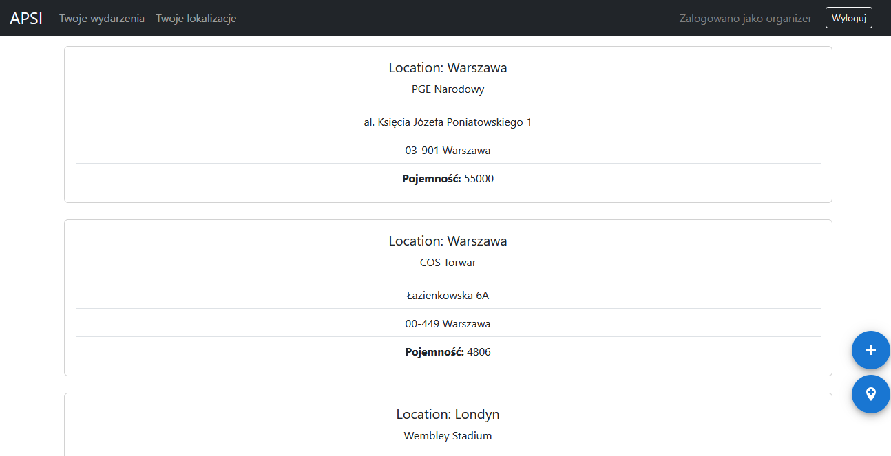
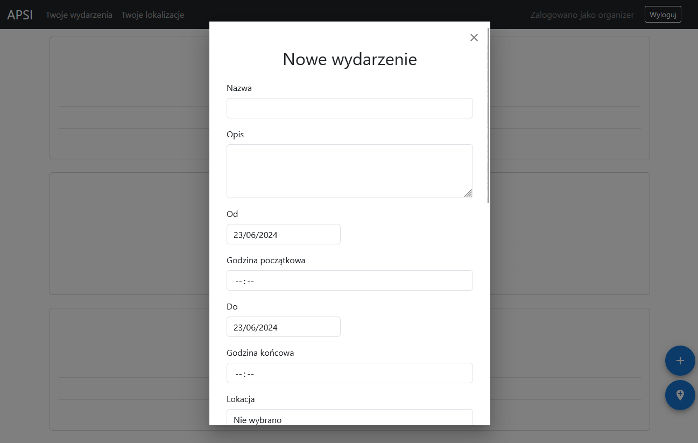
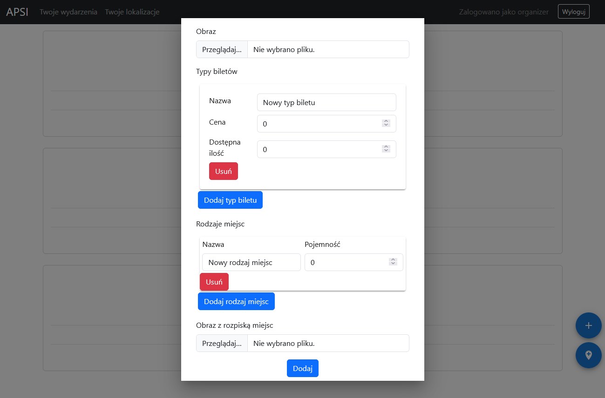

### Tworzenie konta

Aby korzystać z aplikacji organizator musi posiadać specjalne konto. W tym celu musi on wejść na stronę rejestracji (`/register`). Znajduje się na niej link prowadzący do dedykowanego formularza dla organizatorów. Formularz składa się z pól danych konta (`Login`,`Adres e-mail`, `Hasło`, `Powtórz hasło`) oraz pól przeznaczonych dla danych organizatora/organizacji (`Nazwa organizatora`). Aby formularz został zaakceptowany użytkownik musi uzupełnić wszystkie wymagane pola oraz podać nieużyty wcześniej w systemie login oraz e-mail, a wybrane przez niego hasła muszą być identyczne, spełniające wymagania dot. długości. Formularz wysyłany jest przy użyciu przycisku `Wyślij wniosek`. Złożony wniosek musi być następnie zaakceptowany przez administratora. Decyzja dot. wniosku zostaje przesłana w wiadomości na podany wcześniej adres e-mail. Pod formularzem rejestracyjnym znajduje się także link prowadzący do strony logowania.

** TODO APSI-34**

### Logowanie

W celu zalogowania się na konto organizator musi on wejść na stronę logowania (`/login`). Znajduje się na niej formularz, który musi zostać uzupełniony oraz wysłany. Formularz składa się z pól `Login` oraz `Hasło`. Formularz wysyłany jest przy użyciu przycisku `Zaloguj`. Sekwencja logowania zakończy się pomyślnie w przypadku, gdy podana zostanie odpowiednia kombinacja nazwy użytkownika oraz hasła, zgadzająca się z danymi podanymi wcześniej w procesie rejestracji. W innym wypadku organizator zostanie poinformowany o wprowadzeniu niepoprawnego hasła. Po zalogowaniu organizator zostaje przekierowany na stronę główną. Pod formularzem logowania znajduje się także link prowadzący do strony rejestracji.

### Nawigacja i Strona główna

Głównym elementem strony głównej, który również obecny jest na pozostałych stronach aplikacji jest pasek nawigacyjny. Przy jego użyciu organizator może przejść do strony zawierającej listę wydarzeń organizowanych przez niego w ramach aplikacji (przycisk `Twoje wydarzenia`) lub do listy posiadanych lokalizacji (przycisk `Twoje Lokalizacje`). Ponadto pasek nawigacyjny zawiera przycisk `Wyloguj` odpowiadający za wylogowywanie użytkownika z aplikacji oraz przekierowywujący do strony logowania. Dla organizatorów dodatkowo w prawym dolnym rogu wyświetlane są przyciski odpowiadające kolejno za dodanie wydarzenia (ikona ze znakiem plus) oraz dodanie lokalizacji (ikona pinezki).

### Lista wydarzeń organizatora

Na stronie listy wydarzeń organizatora wyświetlane są wszystkie jego eventy organizowane w ramach systemu. Po wejściu na stronę automatycznie wyświetlane są wydarzenia zaplanowane na najbliższy tydzień. Elementy listy wyświetlane są jako niezależne karty zawierające informacje o wydarzeniu, takie jak jego nazwa, opis, lokalizacja oraz data. Organizator może użyć dedykowanego przycisku z ikoną oka, aby przejśc na stronę wydarzenia, zawierającą więcej infomacji na jego temat. W karcie wydarzenia znajduje się również przycisk z ikoną ołówka, przekierowujący na stronę edycji wydarzenia oraz przycisk z ikoną kosza umożliwiający usunięcie wydarzenia. Lista wydarzeń może być filtrowana poprzez użycie wyszukiwarki nazw eventów oraz zmianę zakresu dat wyświetlanych wydarzeń.

** TODO APSI-17**

### Strona wydarzenia

Strona wydarzenia zawiera szczególowe informacje na temat samego wydarzenia oraz sprzedawanych na niego biletów. Organizator może zapoznać się tutaj z informacjami takimi jak nazwa wydarzenia, jego opis, lokalizacja, data początkowa i końcowa oraz rodzaje, dostępność oraz ceny biletów.

### Edycja wydarzenia

** TODO APSI-26**

### Usunięcie wydarzenia

** TODO APSI-27**

### Lista lokalizacji organizatora

Na stronie listy lokalizacji organizatora wyświetlane są wszystkie jego lokalizacje dodane do systemu.

### Edycja lokalizacji

** TODO APSI-31**

### Usunięcie lokalizacji

** TODO APSI-30**

### Tworzenie wydarzenia

W celu dodania nowego wydarzenia organizator musi użyć dedykowanego przycisku z ikoną znaku plus zlokalizowanego w prawym dolnym rogu aplikacji. Wyświetlone zostanie okno z formularzem tworzenia wydarzenia. Organizator musi wypełnić danymi wyświetlane pola, po czym przesłać formularz. Pola `Nazwa`, `Od`, `Do` są obowiązkowe. Należy podać przynajmniej jeden typ biletów. Możliwe jest oddanie grafiki do wydarzenia. Po pomyślnym przesłaniu formularza wyświetlone zostanie potwierdzenie sukcesu operacji.

### Tworzenie lokalizacji

W celu dodania nowej lokalizacji organizator musi użyć dedykowanego przycisku z ikoną pinezki zlokalizowanego w prawym dolnym rogu aplikacji. Wyświetlone zostanie okno z formularzem tworzenia lokalizacji. Organizator musi wypełnić danymi wyświetlane pola, po czym przesłać formularz. Pola `Kraj` oraz `Miejscowość` są obowiązkowe. Po pomyślnym przesłaniu formularza wyświetlone zostanie potwierdzenie sukcesu operacji.