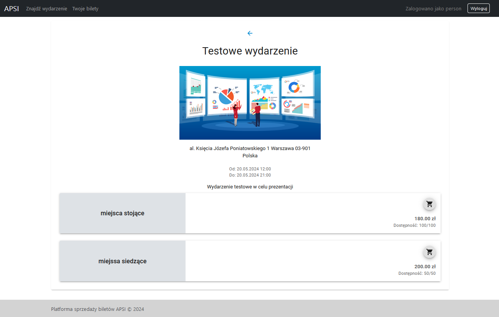
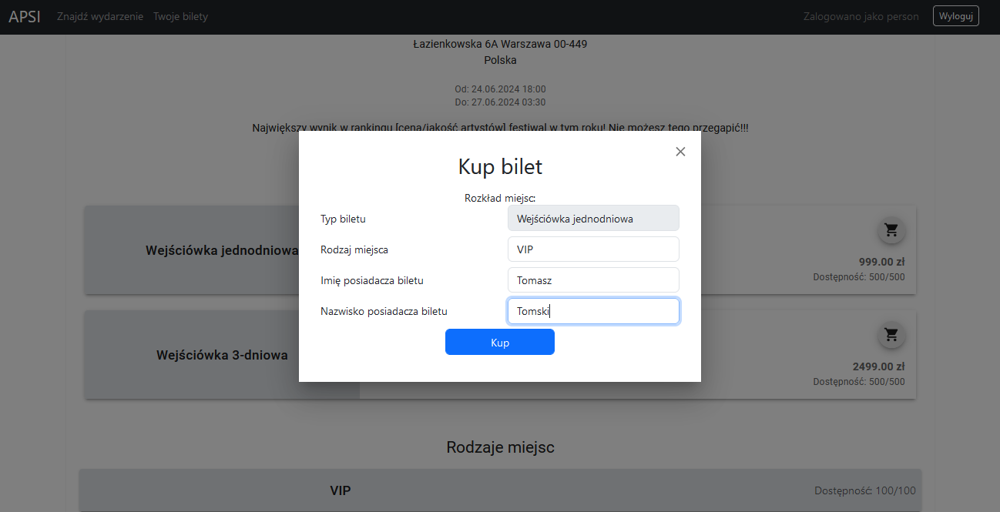
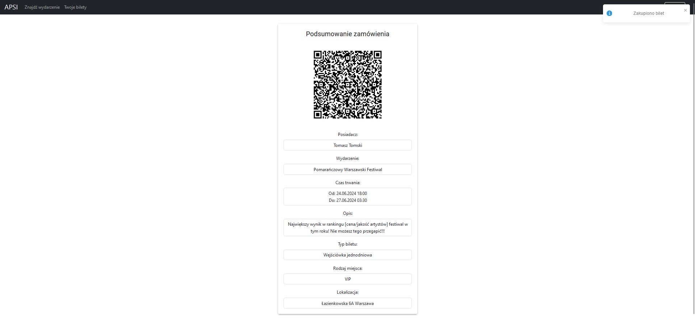
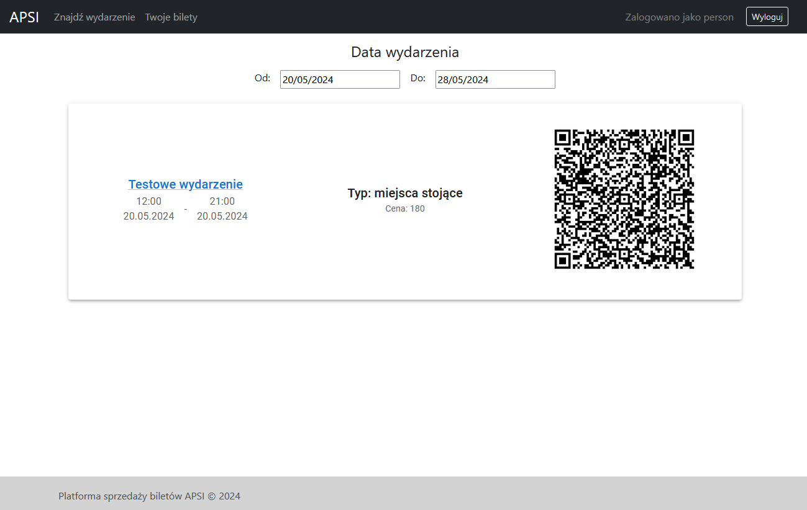

<!-- ### Tworzenie konta

Aby korzystać z aplikacji, użytkownik musi założyć konto. W tym celu musi on wejść na stronę rejestracji (`/register`). Znajduje się na niej formularz, który musi zostać uzupełniony oraz wysłany. Formularz składa się z pól `Login`, `Adres e-mail`, `Hasło` oraz `Powtórz hasło`. Aby formularz został zaakceptowany, użytkownik musi podać nieużyty wcześniej w systemie login oraz e-mail, a wybrane przez niego hasła muszą być identyczne, spełniające wymagania dot. długości. Formularz wysyłany jest przy użyciu przycisku `Zarejestruj`. Po udanej rejestracji użytkownik zostaje przekierowany na stronę logowania. Pod formularzem rejestracyjnym znajduje się także link prowadzący do strony logowania.

** TODO APSI-34** -->

### Logowanie

W celu zalogowania się na konto użytkownik musi on wejść na stronę logowania (`/login`). Znajduje się na niej formularz, który musi zostać uzupełniony oraz wysłany. Formularz składa się z pól `Login` oraz `Hasło`. Formularz wysyłany jest przy użyciu przycisku `Zaloguj`. Sekwencja logowania zakończy się pomyślnie w przypadku, gdy podana zostanie odpowiednia kombinacja nazwy użytkownika oraz hasła, zgadzająca się z danymi podanymi wcześniej w procesie rejestracji. W innym wypadku użytkownik zostanie poinformowany o wprowadzeniu niepoprawnego hasła. Po zalogowaniu użytkownik zostaje przekierowany na stronę główną. Pod formularzem logowania znajduje się także link prowadzący do strony rejestracji.

### Nawigacja i Strona główna

Głównym elementem strony głównej, który również obecny jest na pozostałych stronach aplikacji, jest pasek nawigacyjny. Przy jego pomocy użytkownik może przejść do strony zawierającej listę wydarzeń organizowanych w ramach aplikacji (przycisk `Znajdź wydarzenie`) lub do listy zakupionych przez siebie biletów (przycisk `Twoje Bilety`). Ponadto pasek nawigacyjny zawiera przycisk `Wyloguj` odpowiadający za wylogowywanie użytkownika z aplikacji oraz przekierowujący do strony logowania.

### Lista wydarzeń

Na stronie listy wydarzeń wyświetlane są wszystkie wydarzenia organizowane w ramach systemu. Po wejściu na stronę automatycznie wyświetlane są wydarzenia zaplanowane na najbliższy tydzień. Elementy listy wyświetlane są jako niezależne karty zawierające informacje o wydarzeniu, takie jak jego nazwa, opis, lokalizacja oraz data. Użytkownik może użyć dedykowanego przycisku z ikoną oka, aby przejść na stronę wydarzenia, zawierającą więcej informacji na jego temat. Lista wydarzeń może być filtrowana poprzez użycie wyszukiwarki nazw eventów oraz zmianę zakresu dat wyświetlanych wydarzeń.

<!-- ** TODO APSI-17** -->

### Strona wydarzenia

Strona wydarzenia zawiera szczegółowe informacje na temat samego wydarzenia oraz sprzedawanych na niego biletów. Użytkownik może zapoznać się tutaj z informacjami takimi jak nazwa wydarzenia, jego opis, lokalizacja, data początkowa i końcowa oraz rodzaje, dostępność oraz ceny biletów. Użytkownik może dokonać zakupu wybranego przez siebie rodzaju biletów przy użyciu specjalnego przycisku zakupu. 

### Zakup biletu

Użytkownik może dokonać zakupu na stronie danego wydarzenia (`/event/{id}`). W tym celu musi użyć specjalnego przycisku z ikoną koszyka, znajdującego się przy interesującym go rodzaju biletów. System wyświetli wtedy okienko kupna biletu z prostym formularzem, w którym użytkownik musi wpisać imię oraz nazwisko osoby, która będzie przyszłym posiadaczem biletu. Znajduje się tam również informacja o dacie i formie płatności. Po zakupie biletu zostaje wyświetlone podsumowanie zamówienia, na którym znajdują się podstawowe informacje o bilecie oraz wygenerowany kod QR. 

### Twoje bilety 

Użytkownik może sprawdzić listę posiadanych biletów na stronie `Twoje Bilety` (`/tickets`). Po wejściu na stronę automatycznie wyświetlane są bilety na wydarzenia zaplanowane na najbliższy tydzień. Elementy listy wyświetlane są jako niezależne karty zawierające informacje o bilecie, takie jak opis samego wydarzenia, rodzaj biletu oraz kod QR. Lista biletów może być filtrowana poprzez zmianę zakresu dat wydarzeń.
<!-- 
### Anulowanie biletu

** TODO APSI-38**

### Pobranie biletu

** TODO APSI-52** -->