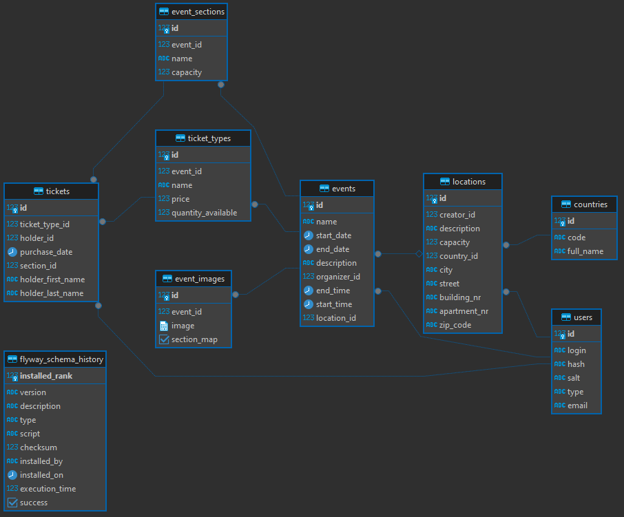

Model danych bazy danych przedstawiony został na powyższym diagramie. Stworzone zostało 9 tabel, gdzie tabela `users` przechowuje informacje dotyczące użytkowników, `events`, `event_images`, `event_sections` dane dotyczce wydarzeń, `locations`, `countries` dane lokalizacji, `tickets`, `ticket_types` dane o biletach. Tabela `flyway_schema_history` zawiera dane dot. migracji bazy.

